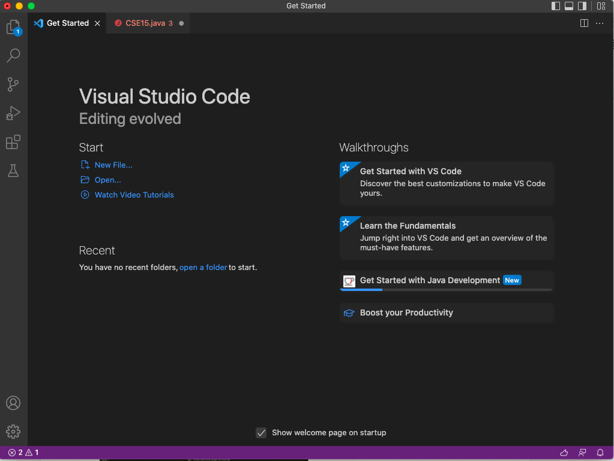
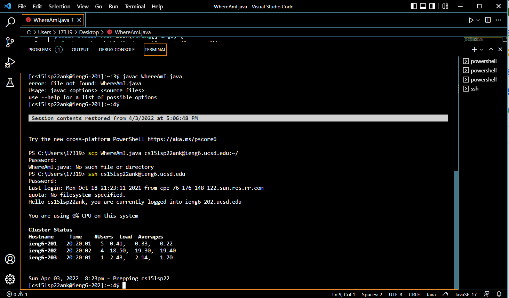
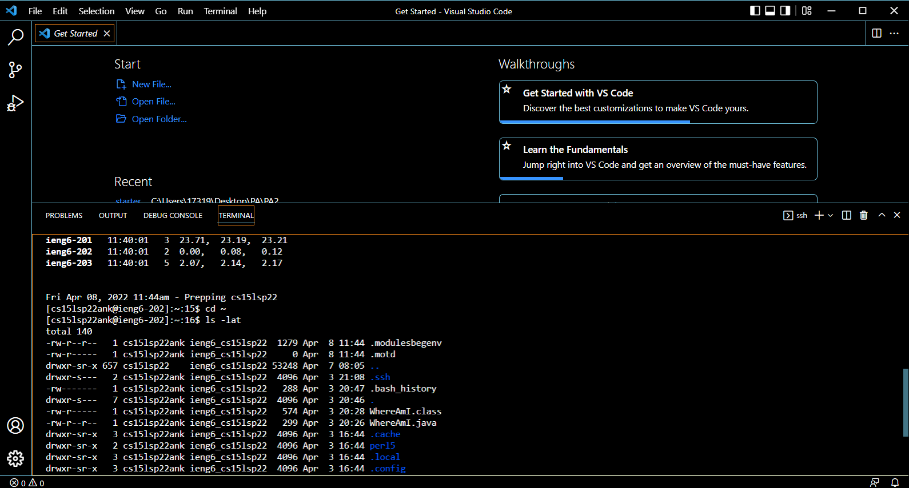
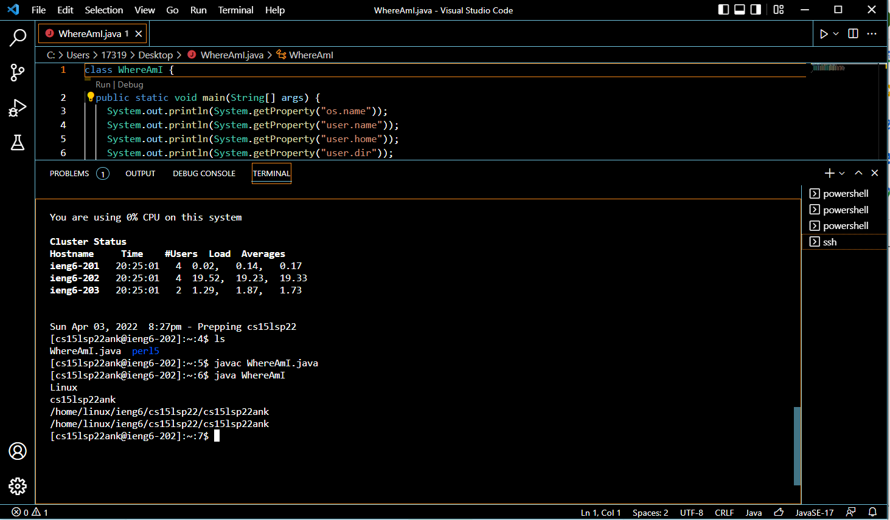
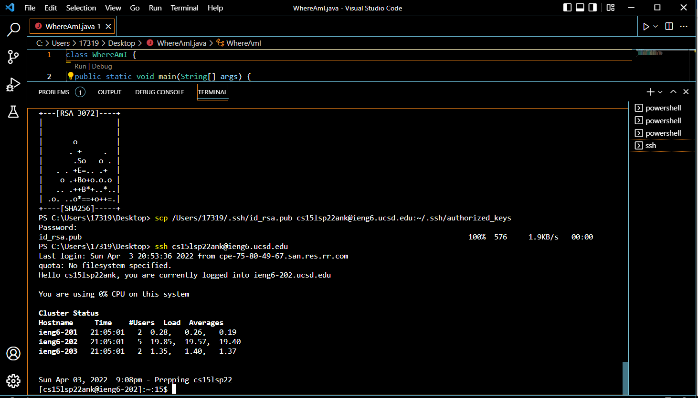
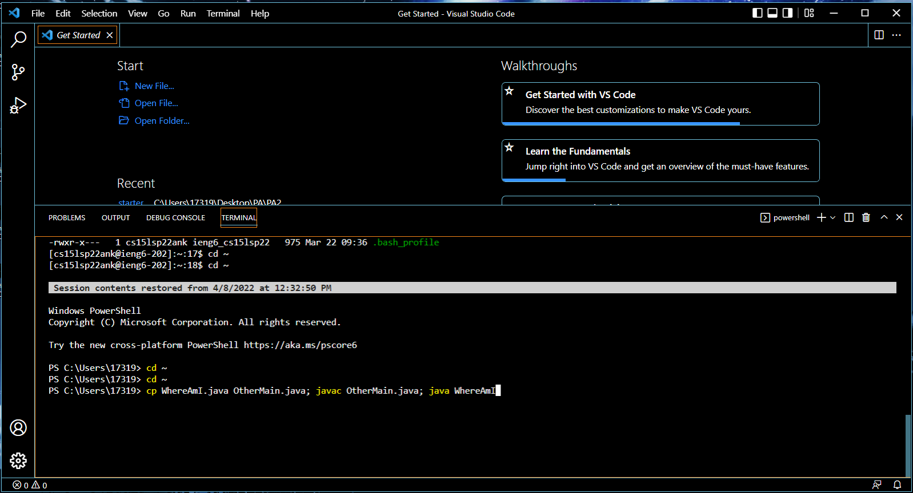

# LAB REPORT 1
**A Tutorial for CSE15L Students!**

*There will be six steps in total*

1. Installing VScode
2. Remotely Connecting
3. Trying Some Commands
4. Moving Files with scp
5. Setting an SSH Key
6. Optimizing Remote Running

# Step 1: Installing VScode

***

First of all, go to the site [VScode](https://code.visualstudio.com/), and install the VScode.

After installing VScode, you should see the home page like this



# Step 2: Remotely Connecting

***

Then in your VScode, open up the terminal by clicking the **Terminal** and create new Terminal. In your terminal, type 
```
ssh cs15lsp22zz@ieng6.ucsd.edu
``` 
with `zz` changed to your own account number. 

Say yes to the messages popped out, and type in your password for your account. Note that for safety reason, the password will not show up in your screen. 

The following image should be what you see after entering the password.


# Step 3: Trying some commands

***

Now we can try some commands. Here I tried 
```
cd ~
``` 
and 
```
ls -lat
```
By showing what the image shows indicate that your command worked fine.



# Step 4: Moving Files with scp

***

In this step, we will be moving files over SSH with the command scp. 

* First create a file called WhereAmI.java in your computer and put the following content in.

```
class WhereAmI {
  public static void main(String[] args) {
    System.out.println(System.getProperty("os.name"));
    System.out.println(System.getProperty("user.name"));
    System.out.println(System.getProperty("user.home"));
    System.out.println(System.getProperty("user.dir"));
  }
}
```

* Then in the terminal, run the command 
```
scp WhereAmI.java cs15lsp22zz@ieng6.ucsd.edu:~/
``` 
with your own username.
* Log into your account using ssh again, then use ls. You should be able to see the file in your home directory.
* Now you can run javac and java without installing java in your computer. You should see something like this screenshot



# Step 5: Setting an SSH key

This step is to make your log in more convenient. By setting up the SSH key, you don't have to enter the password everytime you sign in.

1. First, you need to log off from your account
2. Second, type in 
```
ssh-keygen
```
3. It will show a bunch of phrases like these:
```
Generating public/private rsa key pair.
Enter file in which to save the key (/Users/<user-name>/.ssh/id_rsa): /Users/<user-name>/.ssh/id_rsa
Enter passphrase (empty for no passphrase): 

    Make sure to leave it empty for passphrase
```
4. Then, keep on clicking the enter button until it gives you the Key's randomart image like this picture:



5. Now, log in to your account with ssh again, enter the password, and enter 
```
mkdir .ssh
``` 
to log out. 

6. Type in 
```
scp /Users/<user-name>/.ssh/id_rsa.pub cs15lsp22zz@ieng6.ucsd.edu:~/.ssh/authorized_keys
``` 
with your own user name.

7. After this process, you should be able to log into your account without entering password in the future.

# Step 6: Optimizing Remote Running

There are some useful quick trick to enter your command. For example, you can use the up arrow to reuse the commands you entered before, or you can use ";" to enter two commands at the same time, as shown below.



These tips could help you save a lot of time, especially the up arrow, which personally I used all the time.