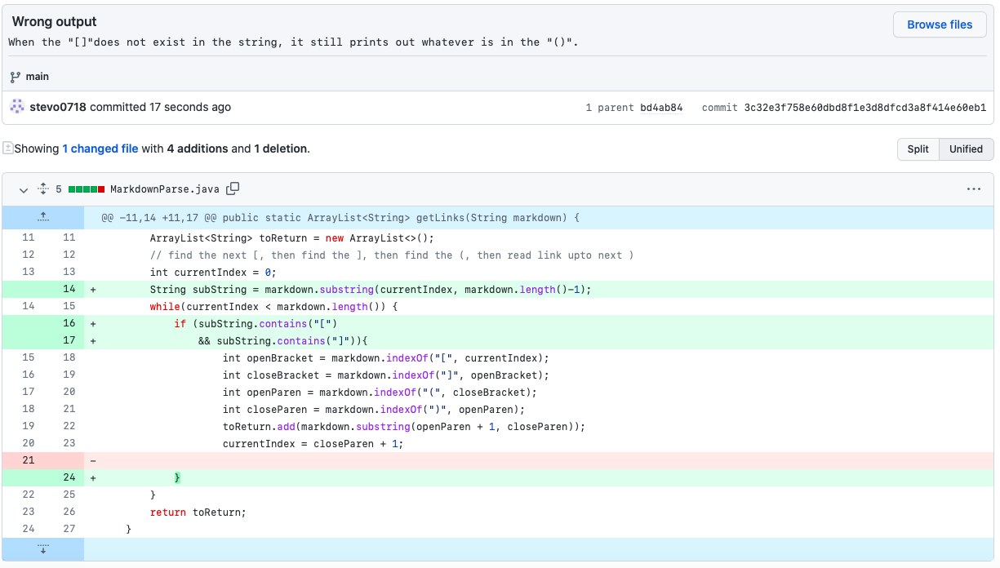
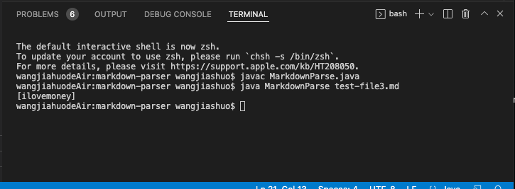
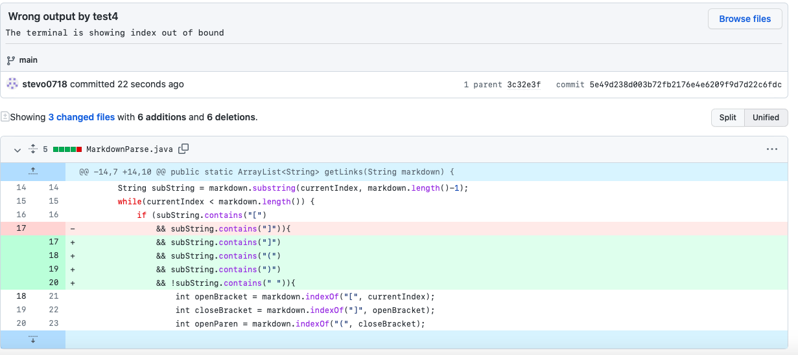
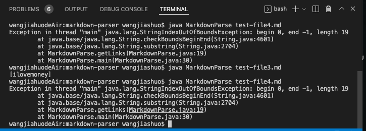
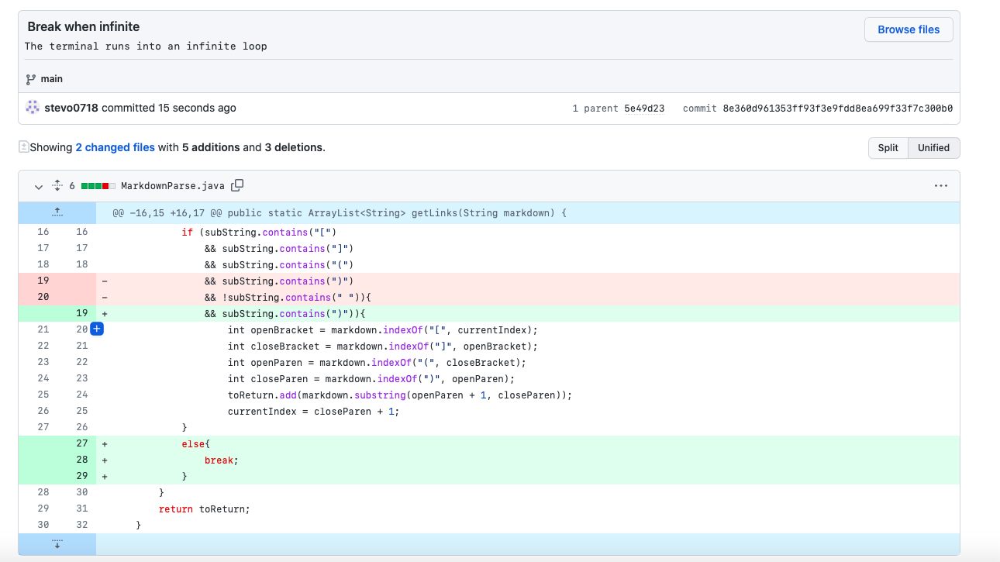
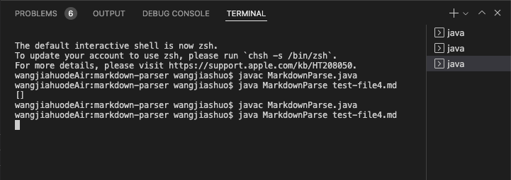

# LAB REPORT 2
**Debugging my code**

*There are 3 main changes to my code to make the progrom run properly*

1. Having trouble finding `[]`
2. Index out of bounds when fingding `()`
3. Infinite loop

# 1st code change

***

The first change:

Test file that prompted me to make the change:

[test-file1](test-file1.md)

The output of the failed code:

When I first run the program with the given code, I found out that the program would print out the invalid link even if the link does not contain `[]`. So I added an if statement to make sure that the code check the `[]` before it goes to print statement in the main method.

# 2nd code change

***

The second change:

Test file that prompted me to make the change:

[test-file2](test-file2.md)

The output of the failed code:

After the first change, I found that I also need to consider the `()` and search for it before the print statement. And I didn't want any spaces inside the same line of the link, so I added a line of `!subString.contains(" ")` to make sure that the link does not have any space inside.

# 3rd code change

***

The third change:

Test file that prompted me to make the change:

[test-file2](test-file2.md)

The output of the failed code:

It is the same file that I found the infinite loop. I noticed that if I don't add an `else{ break }` statement, once the if statement is not met, the while loop will keep on looping and create an infinite loop. Therefore I added an break statement to end the loop. Another change that I made beyond this is that I deleted the space check in the second change, because I found out that if there are spaces in the link line, my code will not print that invalid link.