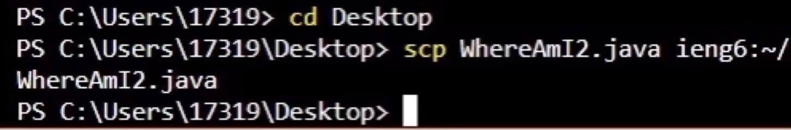

# LAB REPORT 3

*There are 3 parts in this lab report*

1. Streamlining ssh Configuration
2. Setup Github Access from ieng6
3. Copy whole directories with `scp -r`

# 1. Strealining ssh Configuration

***

This is where my config file is located.


And this is how I edited the config file.


After setting up this file, I am able to log in to my account with shorter types 
such as: `ssh ieng6` like the following image:


And I could also move files to my account with shorter types like the following image.



# 2. Setup Github Access from ieng6

***

Here are the ssh keys that I stored in the GitHub Website:


Here are the ssh keys(both public and private) stored in my account:


Then I can run some git commands while logging into my account, like what I did in the following image:


And I could also commit changes to github while logging into my account.


Here is the link to the commit page: [commit](https://github.com/stevo0718/markdown-parser/commit/ab417fe2f8704f5e5450af32016fce52ad69f97b)

# 3. Copy whole directories with `scp -r`

***

With the command:

```
scp -r *.java *.md lib/ cs15lsp22@ieng6.ucsd.edu:markdown-parse
```
I am able to copy the whole directory of markdown-parse to the server with just one commmand.

An example of using this command is the following image:


After adding the file, I am able to compile and run the tests on the server.


Please ignore the failed test. I am still working on the edge cases.

And for even more convenient purpose, I can move the files and run commands together in one line 
using `:` to combine the commands.

