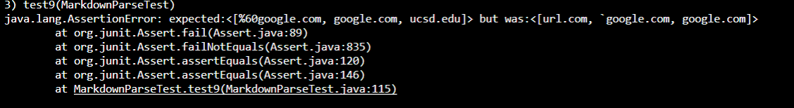

# LAB REPORT 4

*There are 3 snippets to test in this report*

For the 3 snippets, I will run both my code from [here](https://github.com/stevo0718/markdown-parser) and the code we review on Lab 7 from [here](https://github.com/NLChung9/markdown-parser).

# Snippet 1

The correct code should produce `<[%60google.com, google.com, ucsd.edu]>`.

I wrote the tester like this in my code:

When I run my code, it failed and shows this:

I wrote the tester like this in the review file:

When I run the code in the review file, it failed and shows this:

Since my code is showing that it ran out of memory, I assume that it ran into an infinite loop and couldn't get out. I'm still thinking which part of my code went wrong and I think it will require a big change to the code which might take more than 10 lines.

# Snippet 2

The correct code should produce `<[a.com, a.com(()), example.com]>`.

I wrote the tester like this in my code:

When I run my code, it failed and shows this:

I wrote the tester like this in the review file:

When I run the code in the review file, it failed and shows this:

Again, it seems like the code is facing the same challenge as facing scippet 1. The code went into an infinite loop and couldn't excape from it. I might need to reconsider the logic behind my code and check different conditions for different cases like what the review file did.

# Snippet 3

The correct code should produce `<[https://sites.google.com/eng.ucsd.edu/cse-15l-spring-2022/schedule]>`.

I wrote the tester like this in my code:

When I run my code, it failed and shows this:

I wrote the tester like this in the review file:

When I run the code in the review file, it failed and shows this:

Snippet 3 is having the exact same problem as snippet 1 and snippet 2. They all went into an infinite loop. The reason behind it might be that I only checked for brackets and parenthesis and as long as they have these two things, I would consider them as valid links and pass them into the adding process. What I need in my code is conditions that would check different situations that might make the link invalid, which would take more than 10 lines and is considered as a big code change.