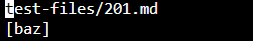
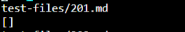
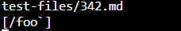
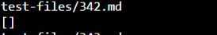

# LAB REPORT 5

*There are 2 tests to discuss in this report*

I used `vimdiff` to compare the results generated by the provided markdown-parser and my own markdown-parser, which I think is very convenient.

Here are the links I chose that have different results:

[test201](https://github.com/nidhidhamnani/markdown-parser/blob/main/test-files/201.md)

[test342](https://github.com/nidhidhamnani/markdown-parser/blob/main/test-files/342.md)

# Test 201

Here is the output generated by the given repository

and here is the output generated by my own repository

and the actual output, given by VScode preview, should be `[]`

By comparison, we can see that my output is correct, and the given output is wrong. There should be no valid link in test 201.

I think the problem in the given repository is that within the while loop as shown below, it should check for othe possible characters other than spaces between the closed bracket and the open parenthesis.

After adding codes to check for the characters in between, this getLinks method should generate the correct output for this test file.

# Test 342

Here is the output generated by the given repository

and here is the output generated by my own repository

and the actual output, given by VScode preview, should be `[]`

By comparison, we can see that my output is correct, and the given output is wrong. There should be no valid link in test 342.

The reason that the given code is making this error is that it did not check for possible marks that might change the state of words, such as ` `` `, which will make the words in between become cited as code. 

To solve this problem, my suggestion would be add another condition checking process before the return statement as shown above. The checking process should check all possible marks that would change the state of words.